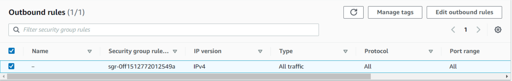
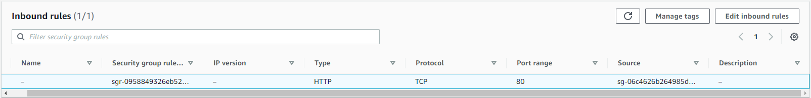
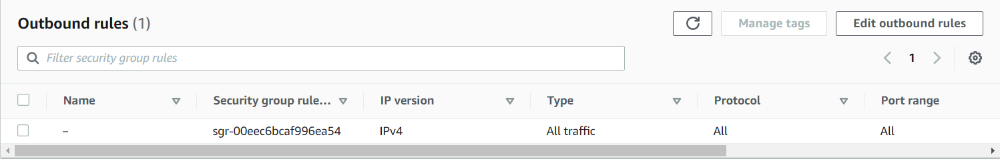
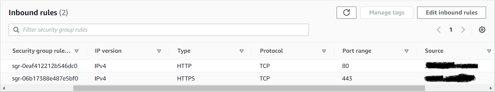
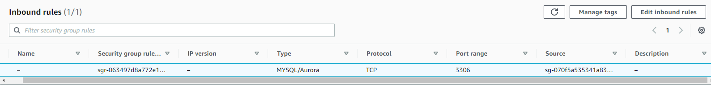
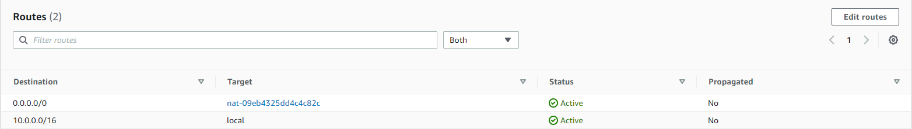
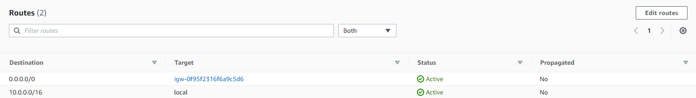
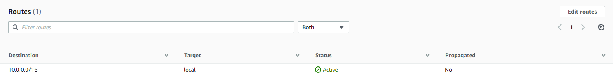

## Cloud_task_AWS 
---------------------------------------------------------------------------------------

#### IAM

1) Create IAM admin user with administrative access for configuring all resourses, which were used in task;
2) Create IAM mentor user with readonly access for assesment the task;
3) Create IAM Role for copuing code from private S3 backet (S3 read only access).

#### Network configurations

1) Create VPC;
2) Create 2 public subnet (1 one each availability zone), 4 privae subnet:  two for RDS
   in each availability zone, two for creating EC2 instances, by autoscalling group.
3) Create internat gateway, attached to VPC. 
4) Amazon RDS -> Subnet Groups -> create subnet group.
5) ###### Create security groups:
    For instances in autoscaling group
    
    
    
   
    For application load balancer:
    
    
    

    For RDS:

    
    
6) ###### Create route tables:
    For instances in autoscaling group, private subnets to nat gateway:
    
    

    For application load balancer, public subnets to internet gateway:
    
    

    For RDS, RDS subnet group to local VPC:

    

#### Creating autoscaling group and launch template

1) User data script, which prepare EC2 instance for deploying application,
   use it in Userdata, wen created Launchtamplate:

```sh
      #!/bin/bash
      # Declare environment variables
      DB_HOSTNAME=db-mysql-crud.cemtf9kzp91w.eu-north-1.rds.amazonaws.com
      DB_NAME=crud
      DB_USERNAME=aleks
      DB_PASSWORD=passwd123
      # Install all necessary packages
      yum update -y
      sudo yum install -y gcc-c++ zlib-devel 
      sudo amazon-linux-extras enable -y php8.1
      sudo yum clean -y metadata
      sudo yum install -y php php-devel
      sudo yum install -y php-{pear,cgi,pdo,common,curl,mbstring,gd,mysqlnd,gettext,bcmath,json,xml,fpm,intl,zip}
      sudo yum install -y httpd
      curl "https://awscli.amazonaws.com/awscli-exe-linux-x86_64.zip" -o "awscliv2.zip"
      unzip awscliv2.zip
      sudo ./aws/install
      # Copy applications' code from S3
      sudo aws s3 cp s3://crud770796886575/php-mysql-crud/ /var/www/html --recursive
      # Give appropriate rights
      sudo usermod -a -G apache ec2-user
      sudo chown -R ec2-user:apache /var/www
      sudo chmod 2775 /var/www
      find /var/www -type d -exec sudo chmod 2775 {} \;
      find /var/www -type f -exec sudo chmod 0664 {} \;
      # Substitude environment variables to db.php file
      sudo sed -i -e "s/'localhost'/'$DB_HOSTNAME'/" /var/www/html/db.php
      sudo sed -i -e "s/'php_mysql_crud'/'$DB_NAME'/" /var/www/html/db.php
      sudo sed -i -e "s/'admin'/'$DB_USERNAME'/" /var/www/html/db.php
      sudo sed -i -e "s/'password123'/'$DB_PASSWORD'/" /var/www/html/db.php
      # Start the web server
      sudo systemctl start httpd
      sudo systemctl enable httpd

```   

2) Create Launch template:
   - don't choose subnet, do it when creating autoscalling group; 
   - assign created IAM role (S3 read only access) for copying sourse code from private S3 backet:
     - Edit launch template -> Advanced detailes -> IAM instance profile;
3) Create autoscaling group:
   - choose launch template;
   - choose existed VPC, two subnets (one per availability zone). It must be private subnets;
   - attach to a new load balancer (create load balancer), choose new target group;
   - Health checks:
     - Pick ELB (This causes the Auto Scaling group to delegate the health check to the Elastic Load Balancer,
       which is capable of checking a specific HTTP(S) URL. This means it can check that an application is
       correctly running on an instance.)
     - Health check grace period:
       This health check grace period is always recommended to have double than the application startup time.
       Suppose, your application takes 10 min to start, you should put health check grace period for 20 min.
   - Automatic scaling:
     - Step scalling;
     - Choose cloud watch alarm:
       - Create two alarms for automating scalling. Which based on
       'RequestCountPerTarget' metric.
        One alarm when requests more then 10 per instance and second when requests less or equal 10 per instance;
   At first create alarm, then assign it with autoscalling target.
     - add appropriate action.

 4) Target group:
    - for target group choose next healthcheck parameters
       + Healthy threshold - 2;
       + Unhealthy threshold - 2;
       + Timeout - 5;
       + Interval - 30;
       + Success codes - 200;
 5) Create application load balancer:
     - two listeners: HTTP and HTTPS (register SSL certificate);
     - HTTP redirect to HTTPS listener, HTTPS forward to target group.

#### Create private S3 bucket

1) Put php-mysql-crud to the bucket;
2) Allow EC2 copy code from private S3: [lgrant my Amazon EC2 instance access to an Amazon S3 bucket](https://aws.amazon.com/ru/premiumsupport/knowledge-center/ec2-instance-access-s3-bucket/); with command: `aws s3 cp s3://crud770796886575/php-mysql-crud/ /var/www --recursive`

#### Create and configure RDS

1) Choose created VPC and subnet group;
2) Create and attach security group, which allows only connect from EC2
   (specify EC2 security group as a source for RDS securoty group).
3) Configure RDS (mysql):
  - `mysql -u admin -p -h <endpoint>` from EC2 which is in allowed security group;
  - create user `CREATE USER 'user'@'%' IDENTIFIED BY 'password';`
  - `CREATE DATABASE dadtabase`
  - `GRANT ALL ON database.* TO 'user'@'%';`
  - `FLUSH PRIVILEGES`
4) Import script.sql by following command:
  `sudo mysql -u aleks -p -h db-mysql-crud.cemtf9kzp91w.eu-north-1.rds.amazonaws.com < crud/database/script.sql`

#### Create SSL certificate. Domain name.
