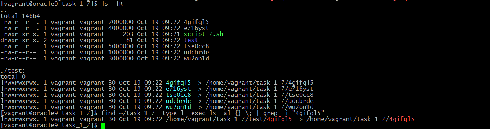

## Module 3 - Linux 
## Task 1
-------------------------------------------------------------------

1) Find all system groups and get only their unique names and IDs. Save it to file.

```sh
cat /etc/login.defs | grep SYS_UID

cat /etc/group | grep -oP '\w+:x:[2-9]\d\d' | cut -d ":" -f 1,3 >> sysgroupid
```


2) Find all files and directories that have permissions to access the corresponding user and group.

```sh
sudo find / -type "f" -group vagrant -perm /u+rwx,g+rwx,o+r
```


3) Find all scripts in the specified directory and its subdirectories.

```sh
find . -type f | xargs -exec file {} \; | grep "Bourne-Again shell script" | cut -d ":" -f1
find . -type f \( -perm -u=x -o -perm -g=x -o -perm -o=x \) -exec grep -l 'bash' {} \;
```


4) Search for script files under a specific user.

```sh
sudo -u test_user_1 find /home/test_user_1/ -type f \( -perm -u=x -o -perm -g=x -o -perm -o=x \) -exec grep -l 'bash' {} \;
```


5) Perform a recursive search for words or a phrase for a specific file type.

```sh
grep --include=\*.{sh,zh} -r '/home/vagrant' -e "random"
```


6) Find duplicate files in specific directories. 

```sh
find . -type f -exec sha224sum {} + | sort | uniq -w32 -dD
find . -type f -printf '%s %f\n' | sort -n | uniq -dD
```


7) Find all symbolic links to file.

```sh
find . -type l -exec ls -al {} \; | grep -i "name searched file"
```



8) Find all links to file.

```sh
find . -samefile ~/task_1_8/<file name>
```


9) Find files belong to a spesific inode number

```sh
find -inum 488395
```


10


11) Delete the file which has a hard or symb links

```sh
find -L . -samefile ~/task_8/file_1 -delete
```


12) Change permmission recursivly in a specific directory.

```sh
find ~/task_1_11/test -type f -print0 | xargs -0 chmod 640
```


13


14) Get network interfases MAC-addresses. 
The following commands can get you the MAC address of your network interface in Linux:

```sh
ifconfig
ip link show
cat /sys/class/net/*/address
arp -a | grep -o -E '([[:xdigit:]]{1,2}:){5}[[:xdigit:]]{1,2}'
```

15) Display list of the current logged in users.

```sh
who | cut -d ' ' -f1 | sort | uniq
```

16) Displaying all active Internet connections:

```sh
netstat -natp
ss -s
```

17) Reasign existing symbolic link

```sh
ln -sfn /home/vagrant/task_1_17/test_new_link/new_point <existed link>
```


18) There is a list of files with a relative path and a path to the directory in which
a symbolic link to the file is stored. Create symbolic links to these files.

```sh
ln -s -r $(cut list -d: -f 1 | head -1| tail -1) $(cut list -d: -f 2 | head -1| tail -1)
```


19) Copy a directory, where are located both relative and direct symbolic links. 
Do it with and without rsync.

```sh
cp -R
rsync -avhK ./sour ./dest
```


20)Copy a directory, where are located both relative and direct symbolic links. 

21) Copy all files and directories from the specified directory to a new location with
preservation of attributes and rights.

```sh
cp -Rp
```


22) In the current directory transfer all relative links to direct links.

```sh
find ./ -type l -execdir bash -c 'ln -sfn "$(readlink -f "$0")" "$0"' {} \;
```


23) In the current directory transfer all direct links to relative links. 

```sh
find . -type l -exec bash -c  'ln -sfr {} $(dirname {})/' \;
```


24) Find all broken links and remove them

```sh
find . -type l -exec sh -c 'for x; do [ -e "$x" ] || rm "$x"; done' _ {} +
```


25) Unpack from a tar, gz, bz2, lz, lzma, xz, Z archives to the specified place.

```sh
tar -cvf archive.tar arch
tar -xf archive.tar --directory ./unpacked/

tar -czvf archive.tar.gz arch
tar -xf archive.tar.gz --directory ./unpacked/arch_gz

tar -cjvf archive.tar.bz2 arch
tar -xjvf archive.tar.bz2 --directory ./unpacked/arch_bz2

sudo yum install lzma; tar -cvf archive.tar arch; lzma archive.tar
xz -cd file.tar.lzma | tar xvf -

tar c arch | xz -z - > archive.tar.xz
xz --decompress archive.tar.xz | tar xvf - 

zip -r archive.zip arch
unzip archive.zip -d ./unpacked/arch_zip
```

26) Preserve permissions while compressing a directories.

```sh
tar -pcvzf file.tar.gz directory
```

27) Recursively copy the directory structure (without contents) from the specified directory.

```sh
find .. -type d | xargs -I{} mkdir -p "/home/vagrant/task_1_27/copyed_dir/dir/{}"
```


28) Display all users (names only) in alphabetical order

```sh
cut -d: -f1 /etc/passwd | sort
```

29) Display a list of all system users of the system sorted by id, in the format: "login ID", 
sorted by ID.

```sh
cat /etc/passwd | grep -oP '\w+:x:[2-9]\d\d' | cut -d ":" -f 1,3 | sort -t ":" -k2.1
```

30) Display a list of all system users of the system sorted by ID in reverse order.

```sh
cat /etc/passwd | grep -oP '\w+:x:[2-9]\d\d' | cut -d ":" -f 1,3 | sort -r -t ":" -k2.1

```

31) Display all users who do not have the rights to log in the system.

```sh
sudo cat /etc/shadow | grep -E "\w+:\*|!"
```

32) List all users who (have/do not have) a terminal (bash, sh, zsh and etc.).

```sh
cat /etc/passwd | grep -e '/bash' -e '/zsh' -e '/usr/bin/sh' | cut -d: -f 1
```


```sh
cat /etc/passwd | grep -v -e '/bash' -e '/zsh' -e '/usr/bin/sh' | cut -d: -f 1
```


33) From the page from the Internet, download all links to href resources that are on the page.

```sh
curl -f -L https://tilda.cc/ua/ | grep -Eo '"(http|https)://[a-zA-Z0-9#~.*,/!?=+&_%:-]*"' >> links
curl -sS https://tomcat.apache.org/download-90.cgi |  grep -Po 'href="\K.*?(?=")' | tail -5 | xargs wget {} \;

```


```sh
wget -m -p -k -np -R '*html*,*htm*,*asp*,*php*,*css*' -X 'www' https://medium.com/javarevisited/6-free-courses-to-learn-bash-shell-scripting-in-linux-and-unix-a50461ecd4fe
```

34) Stop the processes which work more than 5 days. Using by killall and without the killall command.

```sh
killall --older-than 5d $proc_name
find /proc -user myuser -maxdepth 1 -type d -mtime +5 -exec basename {} \; | xargs kill -9 
```

35) There are files and directories (*.txt & *.jpeg). Files *.txt и *.jpeg
connected with each othere unambiguously. Files can be in different places of this directory.
Need to delete all *.jpeg for which there is no *.txt file.

```sh
find . -exec bash -c 'basename "$0" ".${0##*.}"' {} \; | sort | uniq --repeated

```
find . \( -name '*.txt' -o -name '*.jpeg' \) -exec basename {} \;

36) Find your IP address using the command line.

```sh
ip a | grep -oE '[0-9]{1,3}\.[0-9]{1,3}\.[0-9]{1,3}\.[0-9]{1,3}'
```


37) Get all IP addresses from file.

```sh
grep -o '[0-9]\{1,3\}\.[0-9]\{1,3\}\.[0-9]\{1,3\}\.[0-9]\{1,3\}' ip_list
```


38) Get all active hosts in current network

```sh
nmap  -sn  192.168.0.1/24
```


```sh
nmap -F -iL ip_list_38 192.168.0.0/24
```


```sh
seq 254 | xargs printf "192.168.0.%s\n" | xargs -P0 -n1 ping -q -c1 | grep -B1 " 0% packet loss" | grep -B1 " 0% packet loss" | grep -o '[0-9]\{1,3\}\.[0-9]\{1,3\}\.[0-9]\{1,3\}\.[0-9]\{1,3\}'
```


___________________________________________________________________________________


rm -v !("file")
find /home/vagrant -amin +2 -amin -5 -exec rm -rv !("dir_link.sh"){} \;