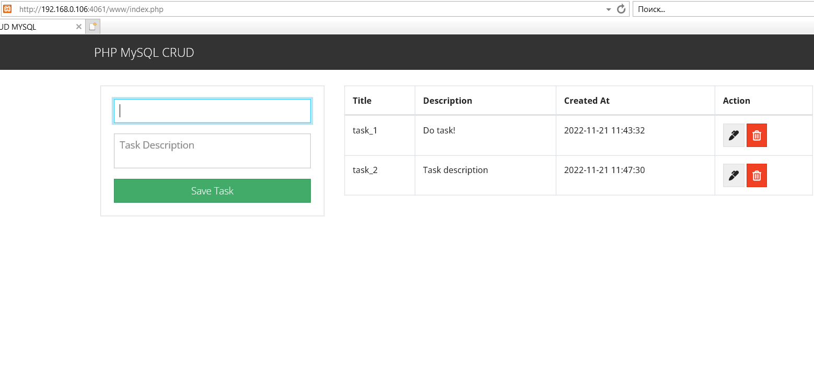

## DOCKER 

---------------------------------------------------------------------------------
In this task I have created docker-compose.yml file and .env file for parameters 
which make using docker-compose easier.
For succesful starting this application in the db.php file I changed next string:

```
  '10.5.0.2',
  'aleks',
  '123456',
  'php_mysql_crud' 
```
There is a test. Which confirms that everything is work:


