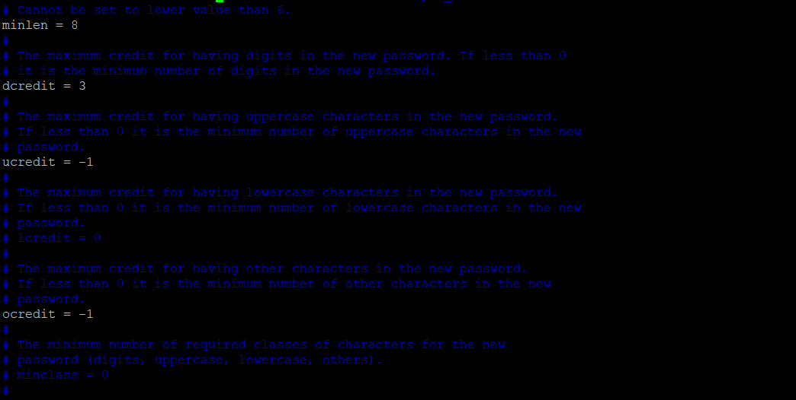
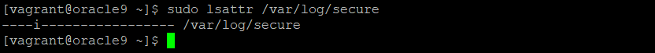
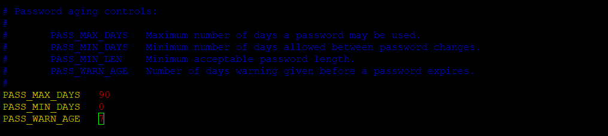
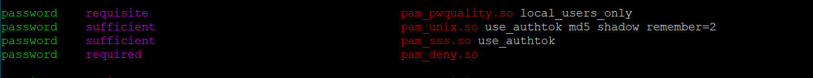
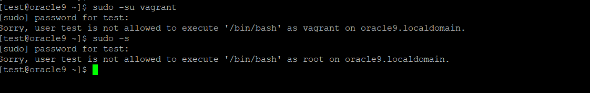
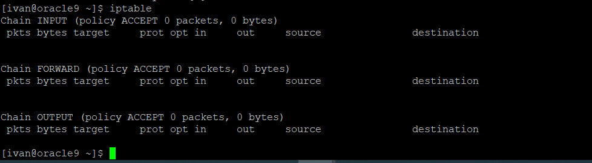
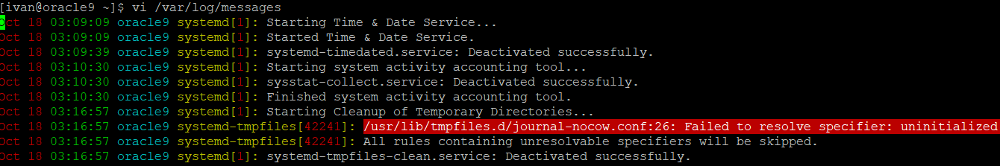
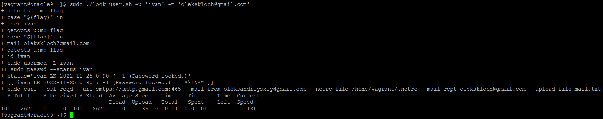

## Module 3 - Linux 
## Task 2
--------------------------------------------------------------------------------------

I divided this task to 5-th parts, and have written an automation script for each part.
In this task I used RHEL based system - Oracle 9.

The first script implement following policies:
 - user’s password length N characters;
 - number up case, low case, number digit and special chars;
 - prevent accidental removal of `/var/log/secure`.

There are result of the executing this script:
|  | 
|:--| 
| *changes in `/etc/security/pwquality.conf` file* |
|  | 
| we can prevent accidental removal by command `chattr` and test it by command `lsattr` |

The second script implement following policies:
 - require password changing every N months/days;
 - it is not allowed to repeat N last passwords;

There are result of the executing this script:
|  | 
| changed in `/etc/login.defs` "PASS_MAX_DAYS" to 90 |
|  | 
| changed in `/etc/pam.d/system-auth` to "pam_unix.so use_authtok md5 shadow remember=2" |

The third script implement the following policies:

 - create user, if it's not exist, set password and add user to sudogroup
 - ask password changing when the 1st user login;
 - deny executing ‘sudo su -’ and ‘sudo -s’;
  - allow existing user execute ‘iptables’ without any command line arguments. Let the user do not type
 ‘sudo iptables’ every time;
 - grant access to the user to read file /var/log/messages without
 using SUDO for the permission;

For executing this script we need to editing next strings in the sudoers file:

    ## These are groups of related commands...
    Cmnd_Alias         SHELLS = /bin/sh, /bin/bash, /bin/bash, /usr/bin/zsh
    Cmnd_Alias         SU = /bin/su

There are result of the executing this script:
|   
                                                                                     | 
 It became possible after creating `etc/sudoers.d/"username"` file and                                       
 adding "$user &emsp;&emsp;&emsp; ALL=(ALL:ALL) &ensp; !SU, &ensp; !SHELLS" &ensp; string in it                                              

|  |                                                                                       

It became possible after adding "$user &emsp;&emsp;&emsp; ALL=(ALL) &ensp; NOPASSWD: &ensp; /usr/sbin/iptables" &ensp; 
to `etc/sudoers.d/"username"` and creating alias by adding `alias iptable='sudo iptables -L -n -v'` string 
to the file `/home/$user/.bashrc`  

|                                                                                          | 

| with the `setfacl -m u:"$user":r /var/log/messages` command we can grant to `$user` permissions for reading |
| file `/var/log/messages`                                                                                    |

The foutth script lock certain user and send him email notification, like in the picture below:

There is executing of thise script:

